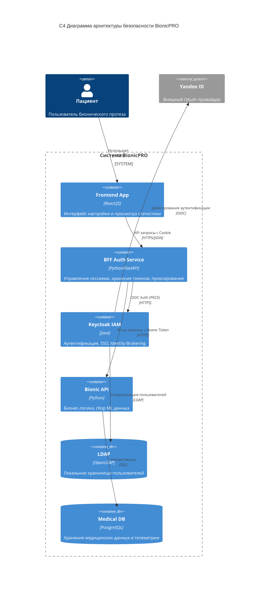

# Архитектурное решение системы BionicPRO

## Описание решения

Предлагаемая архитектура обеспечивает безопасность учётных данных и поддержку требований локализации данных.

### 1. Унификация доступа (Unified Access)
Используется **Keycloak** в качестве центрального Identity Provider (IdP).
- Данные пользователей (ФИО, email, пароли) хранятся в **LDAP**, который может быть развернут локально в стране представительства.
- Keycloak настраивается на синхронизацию с LDAP (User Federation).
- Для внешних провайдеров (например, Яндекс ID) используется механизм **Identity Brokering**.

### 2. Безопасность токенов (BFF Pattern)
Реализован паттерн **Backend for Frontend (BFF)**.
- **Frontend** (React) не получает и не хранит Access/Refresh токены.
- **BFF Service** (`bionicpro-auth`) выступает в роли Confidential Client для Keycloak.
- Аутентификация происходит через перенаправление на BFF, который выполняет обмен Authorization Code на токены (с использованием **PKCE**).
- Токены хранятся в защищённом хранилище сессий на стороне BFF (в памяти или Redis).
- Frontend получает **HTTP-Only Secure Cookie** с идентификатором сессии.
- При запросах Frontend'а BFF проверяет сессию, прикрепляет Access Token и проксирует запрос к целевым сервисам.
- Ротация Refresh Token и Access Token происходит прозрачно для Frontend'а.

### 3. C4 Context/Container Diagram

### Детали реализации безопасности

1.  **Code Grant + PKCE**: BFF инициирует поток авторизации с `code_challenge`. Keycloak проверяет его при обмене кода.
2.  **Secure Cookies**: Cookie `session_id` устанавливается с флагами `HttpOnly`, `Secure`, `SameSite=Strict`.
3.  **Session Rotation**: При обновлении токенов или изменении привилегий идентификатор сессии обновляется для защиты от Session Fixation.
4.  **Data Localization**: Персональные данные хранятся в LDAP/DB в соответствующем контуре. Keycloak лишь агрегирует доступ.
