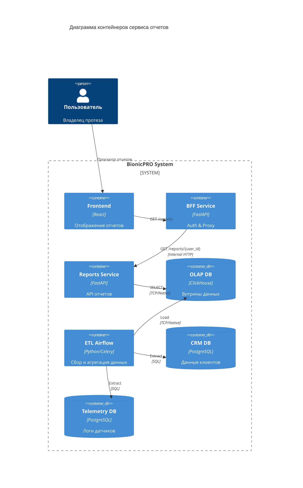

# Архитектура сервиса отчетов

## Описание решения

Система отчетов предназначена для сбора, обработки и предоставления пользователям аналитики по использованию бионических протезов.

### Компоненты

1.  **Sources (Источники данных)**:
    *   **CRM (PostgreSQL)**: Хранит данные о клиентах (ID, имя, контракт, модель протеза).
    *   **Telemetry DB (PostgreSQL)**: Хранит сырые логи с протезов (сигналы, заряд батареи, ошибки, геолокация).

2.  **ETL (Apache Airflow)**:
    *   Оркестратор процессов загрузки данных.
    *   Выполняет регулярный (ежедневный) сбор данных из CRM и Telemetry DB.
    *   Агрегирует данные (среднее время использования, эффективность миосигналов, расход батареи).
    *   Загружает подготовленные витрины в OLAP.

3.  **OLAP (ClickHouse)**:
    *   Аналитическая база данных для быстрого построения отчетов.
    *   Хранит витрину данных `user_daily_reports`.

4.  **Reports Service (Backend API)**:
    *   Микросервис на Python (FastAPI).
    *   Предоставляет API для получения отчетов.
    *   Читает данные из ClickHouse.
    *   Не выполняет тяжелых вычислений, только фильтрацию и форматирование.

5.  **BFF (bionicpro-auth)**:
    *   Единая точка входа для фронтенда.
    *   Аутентифицирует пользователя.
    *   Проксирует запрос в Reports Service, обогащая его ID пользователя (гарантия доступа только к своим данным).

### C4 Container Diagram

